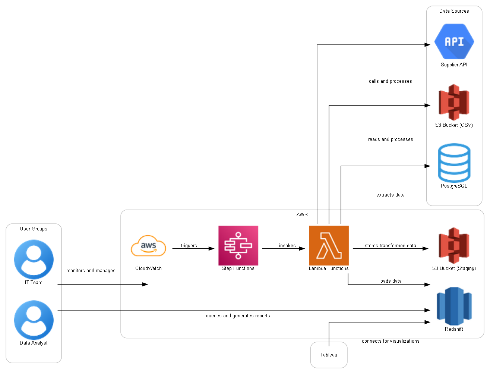

LLM -> syntax -> interpreter -> visualiser

WIP

TODO:

- [x] Add basic syntax generator
- [ ] Add basic visualiser for syntax  
- [ ] Add rough matching for logos  
- [ ] Add approved components and images into prompt for context aware generation  
- [ ] Update prompt to better examples  
- [ ] Add interactivity to the visualiser  
- [ ] Explore finetuning   